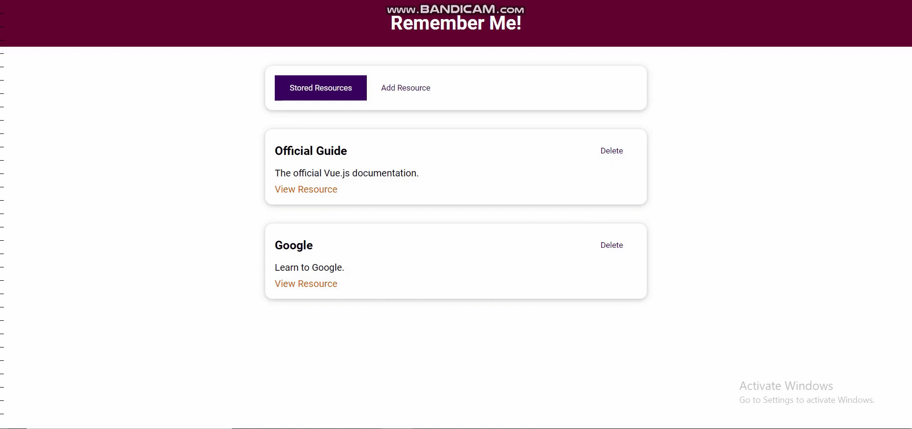

# Learning Resources App

## Table of contents:

- [About](#about)
- [Prerequisites](#prerequisites)
- [Setup](#setup)
- [Features](#features)
- [Demo](#demo)

## About

It's a simple interactive web app built using components concepts in VeuJS.

## Prerequisites

You will need [Node.js](https://nodejs.org) installed on your system.

## Setup

Download the source code as a zip archive.

Once downloaded, open the terminal in the project directory, and continue with:

```
npm install
```

### Compiles and hot-reloads for development

```
npm run serve
```

### Customize configuration

See [Configuration Reference](https://cli.vuejs.org/config/).

## Features

- Showing stored learning resources in the app, each resource has a title, a description and a link for this resource.
- Adding a new resource.
  - Show an error dialog when at least one input is empty, it disappears when clicking on OK button or clicking anywhere in screen.
- Deleting an existing resource.

## Demo


